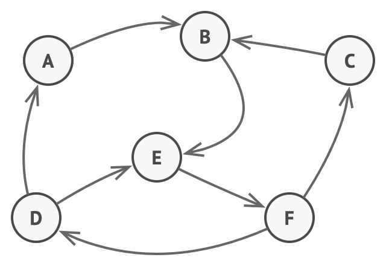

# Design Pattern
**Design patterns** are typical solutions to common problems in software design. Each pattern is like a blueprint that you can customize to solve a particular design problem in your code.

- Creational
- Structural
- **Behavioral**

---

# Behavioral Design Pattern
***Behavioral design patterns*** are concerned with algorithms and the assignment of responsibilities between objects.

- Chain of Responsibility
- Command
- Iterator
- Mediator
- Memento
- Observer
- **State**
- Strategy
- Template Method
- Visitor

---

# State 
**State** is a behavioral design pattern that lets an object alter its behavior when its internal state changes. It appears as if the object changed its class.



---

# Example

```go
type Featureflag struct {
    State string

    k, v, role string
}

func (d *Featurfelag) Publish() {
    switch d.State {
        case "active":
        case "requested":
        case "approved":
            if d.role != "lead" {
                fmt.Panicln("wrong role")
            }
        case "rejected":
    }
}
```