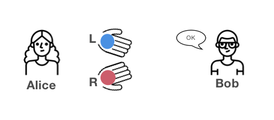

# Encryption

- Encryption-in-transit
- Encryption-at-rest
- End-to-end encryption

---

# Encryption-in-transit
**Encryption-in-transit** secures a message, while it is being transmitted between two parties. (i.e. between your computer and the cloud provider)

This means that, while transferring data is secure, stored docs are 100% decrypted.

---

# Encryption-at-rest
**Encryption-at-rest** protects the file or data on the server while not being used.

Files are encrypted while stored, but not secure when transferred.

---

# End-to-end Encryption
**End-to-end encryption** is a system of communication where only the communicating users (who have the key) can read the messages. User data is decrypted but only on their personal device, never on the server.

---

# Zero Knowledge Encryption
**Zero-Knowledge Encryption**, means that you, and only you, own the password and there is no other way to have access to the data. Not even the service provider has the power.

Don’t even need to trust your provider. *It’s not about trust, it’s about maths*.

## Example 1

## Example 2

- Name: Jack
- Gender: M
- KTP: 123445667995544
- Vaccinated: true

---

## Method

Feige-Fiat-Shamir 1988 https://link.springer.com/article/10.1007/BF02351717

1. Prover and Verifier choose two large prime integers p and q and compute the product $$ n = pq $$
Example:
p = 101
q = 23
**n = 2,323**

2. Prover create secret numbers coprime to n $$ s_{1},\cdots ,s_{k} $$
s1 = 5
s2 = 7
s3 = 3

3. Verifier chooses numbers $$ a_{1},\cdots ,a_{k} $$ where $$ a_{i} $$ equals 0 or 1
Example:
a1 = 1
a2 = 0
a3 = 1

4. Prover chooses a random integer r, computes x and send it to Verifier $$ {\displaystyle s\cdot x\equiv r^{2}{\pmod {n}}} $$
Example:
s = 1
r = 13
**x = 169**

5. Prover computes y and send it to Verifier $$ y\equiv r\cdot (s_{1}^{{a_{1}}}s_{2}^{{a_{2}}}\cdots s_{k}^{{a_{k}}}){\pmod  {n}} $$

6. Prover computes v and send it to Verifier $$ v_{i}\equiv s_{i}^{{2}}{\pmod  {n}} $$ 

7. Verifier checks that $$ {\displaystyle y^{2}{\pmod {n}}\equiv \pm \,xv_{1}^{a_{1}}v_{2}^{a_{2}}\cdots v_{k}^{a_{k}}{\pmod {n}}} $$ and that $$ {\displaystyle x\neq 0.} $$